# Xamarin Test Cloud Guide for Xamarin.Forms Applications

When we begin writing C# UI test scripts for our Xamarin.Forms application, it is important that we know how to interact with each UI element on iOS and Android. This guide is meant to cover all control scenarios in Xamarin.Forms.

This tutorial covers the [Views](https://developer.xamarin.com/guides/xamarin-forms/controls/views/) Xamarin has documented and explain the best way to interact with that control on iOS and Android in a C# UI test.

## `ActivityIndicator`

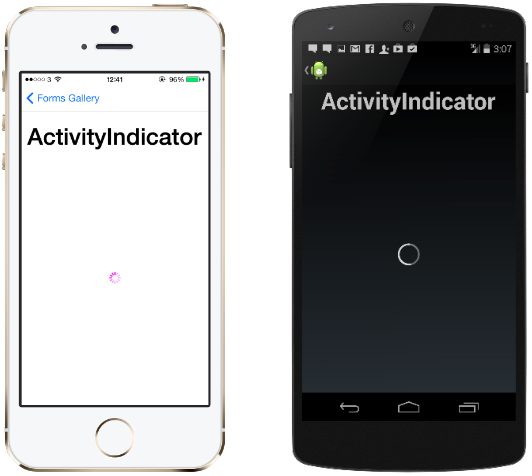

### Uniquely Identifying a `ActivityIndicator` on iOS

Native Control: [`UIActivityIndicatorView`](https://github.com/xamarin/Xamarin.Forms/blob/74cb5c4a97dcb123eb471f6b1dffa1267d0305aa/Xamarin.Forms.Platform.iOS/Renderers/ActivityIndicatorRenderer.cs)
Setting the `AutomationId` property on the `ActivityIndicator` will translate to the `Id` property to identify in `Xamarin.UITest`.

### Uniquely Identifying a `ActivityIndicator` on Android

Native Control: [Android.Widget.ProgressBar](https://github.com/xamarin/Xamarin.Forms/blob/master/Xamarin.Forms.Platform.Android/Renderers/ActivityIndicatorRenderer.cs)
Setting the `AutomationId` property on the `ActivityIndicator` will translate to the `Label` property to identify in `Xamarin.UITest`.

### Setting `AutomationId` for `ActivityIndicator` in Xamarin.Forms Project

```C#
ActivityIndicator indicator = new ActivityIndicator { AutomationId = "LoadingIndicator"};

```

### Interacting with an `ActivityIndicator` in Xamarin.UITest Project

Since `Marked` looks at both the `Id` and `Label` properties, we can use `Marked` to uniquely identify the `ActivityIndicator` on both iOS and Android.

```C#
app.WaitForElement(x => x.Marked("LoadingIndicator"));
app.WaitForNoElement(x => x.Marked("LoadingIndicator))
```

The code above would be an example of waiting for the `ActivityIndicator` to appear on the screen or disappear from the screen. It is common to use the `ActivityIndicator` appearing to wait for information to begin loading on the screen and then the `ActivityIndicator` disappearrance to assume all of the data has been loaded on the screen. The code above would acheive this desired effect.

## `BoxView`


### Uniquely Identifying a `BoxView` on iOS

Native Control: [BoxView](https://github.com/xamarin/Xamarin.Forms/blob/74cb5c4a97dcb123eb471f6b1dffa1267d0305aa/Xamarin.Forms.Platform.iOS/Renderers/BoxRenderer.cs)
Setting the `AutomationId` property on the `BoxView` will translate to the `Id` property to identify in `Xamarin.UITest`.

### Uniquely Identifying a `BoxView` on Android

Native Control: [BoxView](https://github.com/xamarin/Xamarin.Forms/blob/master/Xamarin.Forms.Platform.Android/Renderers/BoxRenderer.cs)
Setting the `AutomationId` property on the `BoxView` will translate to the `Label` property to identify in `Xamarin.UITest`.

### Setting `AutomationId` for a `BoxView` in Xamarin.Forms Project

```C#
BoxView indicator = new BoxView { AutomationId = "MyBox"};

```

### Interacting with a `BoxView` in Xamarin.UITest Project

Since `Marked` looks at both the `Id` and `Label` properties, we can use `Marked` to uniquely identify the `BoxView` on both iOS and Android.

```C#
app.Tap(x => x.Marked("MyBox"));
```

## `Button`

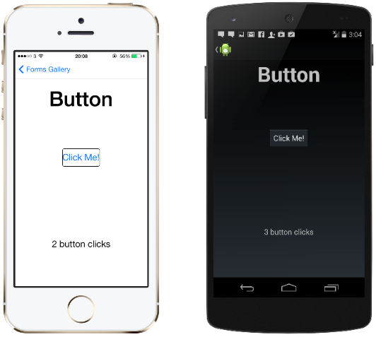

### Uniquely Identifying a `Button` on iOS

Native Control: [UIButton](https://github.com/xamarin/Xamarin.Forms/blob/74cb5c4a97dcb123eb471f6b1dffa1267d0305aa/Xamarin.Forms.Platform.iOS/Renderers/ButtonRenderer.cs)  
Setting the `AutomationId` property on the `Button` will translate to the `Id` property to identify in `Xamarin.UITest`. The `Label` property to identify in `Xamarin.UITest` will be whatever the `Button.Text` property is set to.

### Uniquely Identifying a `Button` on Android

Native Control: [Android.Widget.Button](https://github.com/xamarin/Xamarin.Forms/blob/master/Xamarin.Forms.Platform.Android/Renderers/ButtonRenderer.cs)
Setting the `AutomationId` property on the `Button` will translate to the `Label` property to identify in `Xamarin.UITest`. The `Text` property to identify in `Xamarin.UITest` will be whatever the `Button.Text` property is set to.

### Setting `AutomationId` for a `Button` in Xamarin.Forms Project

```C#
Button loginButton = new Button { AutomationId = "LoginButton"};

```

### Interacting with a `Button` in Xamarin.UITest Project

Since `Marked` looks at both the `Id` and `Label` properties, we can use `Marked` to uniquely identify the `Button` on both iOS and Android.

```C#
app.Tap(x => x.Marked("LoginButton"));
```

## `DatePicker`

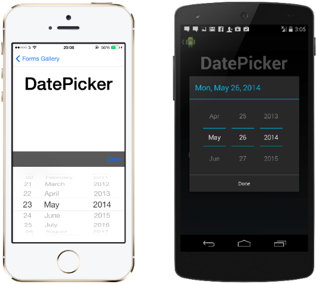

This is a control that needs to be handled differently for iOS and Android. We will also need to know how to invoke the native methods to set the date.

### Uniquely Identifying a `DatePicker` on iOS

Native Control: [UITextField](https://github.com/xamarin/Xamarin.Forms/blob/74cb5c4a97dcb123eb471f6b1dffa1267d0305aa/Xamarin.Forms.Platform.iOS/Renderers/DatePickerRenderer.cs) with internal `UIDatePicker`
Setting the `AutomationId` property on the `DatePicker` will translate to the `Id` property to identify in `Xamarin.UITest`.

We will need to first tap on the `UITextField` to engage the `UIDatePicker`. From there we will need to invoke the native method `selectRow()` on the `UIDatePicker` and press the "ok" button.

### Setting `AutomationId` for a `DatePicker` in Xamarin.Forms Project

```C#
DatePicker datePicker = new DatePicker { AutomationId = "MyDatePicker"};

```

### Interacting with an iOS `DatePicker` in Xamarin.UITest Project

```C#
//Activate the DatePicker
app.Tap(x => x.Id("{MyDatePicker}"));

//Wait for DatePicker animation to completed
app.WaitForElement(x => x.Class("UIPickerView"));

//Invoke the native method selectRow() 
app.Query (x => x.Class ("UIPickerView").Invoke ("selectRow", date.Month - 1 , "inComponent", 0, "animated", true));
app.Query (x => x.Class ("UIPickerView").Invoke ("selectRow", date.Day - 1, "inComponent", 1, "animated", true));
app.Query (x => x.Class ("UIPickerView").Invoke ("selectRow", date.Year - 1, "inComponent", 2, "animated", true));
```

The code above shows how we can invoke the `selectRow()` method on the DatePicker. The "Done" button will always have an `Class` property of "UIToolbarTextButton".

### Uniquely Identifying a `DatePicker` on Android

Native Control: [Android.Widget.DatePicker](https://github.com/xamarin/Xamarin.Forms/blob/master/Xamarin.Forms.Platform.Android/Renderers/DatePickerRenderer.cs) with `Android.Widget.EditText`  
Setting the `AutomationId` property on the `DatePicker` will translate to the `Label` property to identify the `Android.Widget.EditText`.

We will need to first tap on the `Android.Widget.EditText` to engage the `Android.Widget.DatePicker`. From there we will need to invoke the native method `updateDate()` on the `Android.Widget.DatePicker` and press the "ok" button.

### Setting `AutomationId` for a `DatePicker` in Xamarin.Forms Project

```C#
DatePicker datePicker = new DatePicker { AutomationId = "MyDatePicker"};

```

### Interacting with an Android `DatePicker` in Xamarin.UITest Project

```C#
//Activate the DatePicker
app.Tap(x => x.Id("{MyDatePicker}"));

//Wait for DatePicker animation to completed
app.WaitForElement(x => x.Class("DatePicker"));

//Invoke updateDate() method on displayed DatePicker
app.Query(x => x.Class("DatePicker").Invoke("updateDate",date.Year,date.Month,date.Day));

//Tap the ok button to close the DatePicker dialogue
app.Tap(x => x.Id("button1"));//Ok Button in DatePicker Dialogue
```

The code above shows how we can invoke the `updateDate()` method on the DatePicker. The "ok" button will always have an `Id` property of "button1". The "cancel" button will always have an `Id` property of "button2"

## `Editor`


### Uniquely Identifying a `Editor` on iOS

Native Control: [UITextField](https://github.com/xamarin/Xamarin.Forms/blob/master/Xamarin.Forms.Platform.iOS/Renderers/EditorRenderer.cs)
Setting the `AutomationId` property on the `Editor` will translate to the `Id` property to identify in `Xamarin.UITest`.

### Uniquely Identifying a `Editor` on Android

Native Control: [Android.Widget.EditText](https://github.com/xamarin/Xamarin.Forms/blob/master/Xamarin.Forms.Platform.Android/Renderers/EditorRenderer.cs)
Setting the `AutomationId` property on the `EditText` will translate to the `Label` property to identify the `Android.Widget.EditText`.

### Setting `AutomationId` for an `Editor` in Xamarin.Forms Project

```C#
Editor editor = new Editor { AutomationId = "NewsEditor"};
```

### Interacting with an `Editor` in Xamarin.UITest Project

Since `Marked` looks at both the `Id` and `Label` properties, we can use `Marked` to uniquely identify the `Editor` on both iOS and Android.

```C#
//EnterText into Editor
app.EnterText(x => x.Marked("NewsEditor"), "This is some text");
app.DismissKeyboard();

//ClearText from Editor
app.ClearText(x => x.Marked("NewsEditor"));
app.DismissKeyboard();
```

The code above is an example of entering text into the Editor and clearing text from the Editor. Make sure you don't forget to dismiss the keyboard afterwards to ensure the keyboard isn't covering up any UI elements.

## `Entry`


### Uniquely Identifying a `Entry` on iOS

Native Control: [UITextField](https://github.com/xamarin/Xamarin.Forms/blob/master/Xamarin.Forms.Platform.iOS/Renderers/EntryRenderer.cs) 
Setting the `AutomationId` property on the `Entry` will translate to the `Id` property to identify in `Xamarin.UITest`.

### Uniquely Identifying a `Entry` on Android

Native Control: [Android.Widget.EditText](https://github.com/xamarin/Xamarin.Forms/blob/master/Xamarin.Forms.Platform.Android/Renderers/EntryEditText.cs)
Setting the `AutomationId` property on the `EditText` will translate to the `Label` property to identify the `Android.Widget.EditText`.

### Setting `AutomationId` for an `Entry` in Xamarin.Forms Project

```C#
Entry usernameEntry = new Entry { AutomationId = "UsernameEntry"};
```

### Interacting with an `Entry` in Xamarin.UITest Project

Since `Marked` looks at both the `Id` and `Label` properties, we can use `Marked` to uniquely identify the `Entry` on both iOS and Android. 

```C#
//EnterText into Entry
app.EnterText(x => x.Marked("UsernameEntry"), "This is some text");
app.DismissKeyboard();

//ClearText from Entry
app.ClearText(x => x.Marked("UsernameEntry"));
app.DismissKeyboard();
```

The code above is an example of entering text into the Entry and clearing text from the Entry. Make sure you don't forget to dismiss the keyboard afterwards to ensure the keyboard isn't covering up any UI elements.

## `Image`

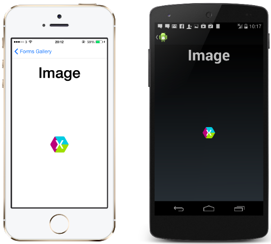

This is a control that needs to be handled differently for iOS and Android. We will also need to know how to invoke the native methods to set the date.

### Uniquely Identifying a `Image` on iOS

Native Control: [UIImage](https://github.com/xamarin/Xamarin.Forms/blob/master/Xamarin.Forms.Platform.iOS/Renderers/ImageRenderer.cs)
Setting the `AutomationId` property on the `Entry` will translate to the `Id` property to identify in `Xamarin.UITest`.

### Uniquely Identifying a `Image` on Android

Native Control: [Android.Widget.ImageView](https://github.com/xamarin/Xamarin.Forms/blob/master/Xamarin.Forms.Platform.Android/Renderers/ImageRenderer.cs)
Setting the `AutomationId` property on the `Image` will translate to the `Label` property to identify the `Android.Widget.ImageView`.

### Setting `AutomationId` for an `Image` in Xamarin.Forms Project

```C#
Image profilePic = new Image { AutomationId = "ProfilePicture"};
```

### Interacting with an `Image` in Xamarin.UITest Project

Since `Marked` looks at both the `Id` and `Label` properties, we can use `Marked` to uniquely identify the `Image` on both iOS and Android.

```C#
app.Query((x => x.Marked("ProfilePicture"));
```

## `Label`

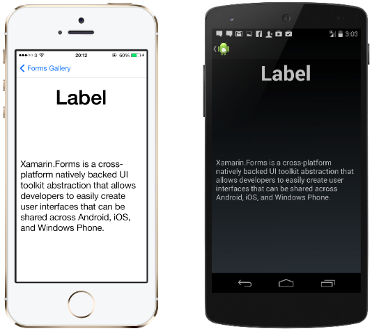

### Uniquely Identifying a `Label` on iOS

Native Control: [UILabel](https://github.com/xamarin/Xamarin.Forms/blob/master/Xamarin.Forms.Platform.iOS/Renderers/LabelRenderer.cs) 
Setting the `AutomationId` property on the `Xamarin.Forms.Label` will translate to the `Id` property to identify in `Xamarin.UITest`.

### Uniquely Identifying a `Label` on Android

Native Control: [Android.Widget.TextView](https://github.com/xamarin/Xamarin.Forms/blob/master/Xamarin.Forms.Platform.Android/Renderers/LabelRenderer.cs)
Setting the `AutomationId` property on the `Xamarin.Forms.Label` will translate to the `Label` property to identify the `Android.Widget.TextView`.

### Setting `AutomationId` for a `Label` in Xamarin.Forms Project

```C#
Label usernameLabel = new Label { AutomationId = "MyLabel"};
```

### Interacting with a `Label` in Xamarin.UITest Project

Since `Marked` looks at both the `Id` and `Label` properties, we can use `Marked` to uniquely identify the `Xamarin.Forms.Label` on both iOS and Android.

```C#
app.Query((x => x.Marked("MyLabel"));
```

## `ListView`

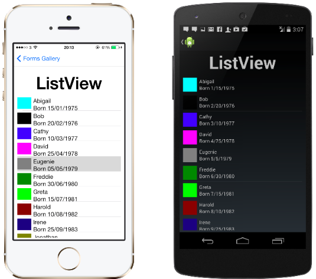

This is a control that needs to be handled differently for iOS and Android. We will also need to know how to invoke the native methods to set the date.

### Uniquely Identifying a `ListView` on iOS

Native Control: [UITableView](https://github.com/xamarin/Xamarin.Forms/blob/master/Xamarin.Forms.Platform.iOS/Renderers/ListViewRenderer.cs) 
Setting the `AutomationId` property on the `Xamarin.Forms.Label` will translate to the `Id` property to identify in `Xamarin.UITest`.

### Uniquely Identifying a `ListView` on Android

Native Control: [Android.Widget.ListView](https://github.com/xamarin/Xamarin.Forms/blob/master/Xamarin.Forms.Platform.Android/Renderers/ListViewRenderer.cs)
Setting the `AutomationId` property on the `Xamarin.Forms.ListView` will translate to the `Label` property to identify the `Android.Widget.ListView`.

### Setting `AutomationId` for a `ListView` in Xamarin.Forms Project

```C#
ListView myList = new ListView { AutomationId = "MyListView"};
```

### Interacting with a `ListView` in Xamarin.UITest Project

Since `Marked` looks at both the `Id` and `Label` properties, we can use `Marked` to uniquely identify the `Xamarin.Forms.ListView` on both iOS and Android.

```C#
app.Query((x => x.Marked("MyListView"));
```

#### Interacting with Pull-to-refresh on `Xamarin.Forms.ListView`
We must handle the Pull-to-refresh differently between iOS and Android. This is because the refreshing indicator is handled differently on each platform. On iOS, there is a `UIRefreshControl` that is displayed when the pull-to-refresh command is executing. On Android, we have to invoke the native `android.support.v4.widget.SwipeRefreshLayout.isRefreshing()` method. This will tell us if the refresh loading indicator is displayed or not. 

```C#
public bool RefreshIndicatorIsDisplayed
{
    get
    {
        if (OnAndroid)
            return (bool)app.Query(x => x.Class("SwipeRefreshLayout").Invoke("isRefreshing")).First();

        if (OniOS)
            return (bool)app.Query(x => x.Class("UIRefreshControl")).Any();

        throw new Exception("Platform Not Recognized");
    }
}
```

The above code example returns a boolean whether the `Xamarin.Forms.ListView` refresh indicator is displayed or not. We may want to wait for the refresh indicator to appear or disappear, so we will need to create a method to handle this for us.

```C#
public void WaitForIndicatorToDisappear(int timeoutInSeconds = 10)
{
    int counter = 0;
    while (RefreshIndicatorIsDisplayed)
    {
        Thread.Sleep(200);//Value determined by user
        counter++;

        if (counter >= timeoutInSeconds)
            throw new Exception($"Loading the list took longer than {timeoutInSeconds}");
    }
}
```

In this example we are periodically checking to see if the refresh indicator is displayed and performing this in a loop. If we exceed the timeout given, we throw an exception with an error message that is specific to our application. 

#### Interacting with Cells in the ListView

I get questions about this a lot and we are going to discuss a little theory here. This guide is meant to explain how to test your application, not how to test the native operating system. For example, if your application has a list of cells that are all the same type (DataTemplate is the same for each cell), we should only test interacting with the first cell in the list. This is because every cell in the list should be handled the exact same way. If we test tapping every single cell, we are really testing that the native operating system acts as we expect. In my opinion, this is a waste of time because you have no control over bugs introduced by Apple or Android. We should expect the native SDKs to work as expected and we can consider this an assumption of our tests.

To interact with the first cell in the ListView, we would do something like the following:

```C#
public void SelectFirstCellInList(int timeoutInSeconds = 20)
{
    Func<AppQuery,AppQuery> firstCellInList;

    if (OnAndroid)
        firstCellInList = x => x.Class("ViewCellRenderer_ViewCellContainer").Index(0);
    else if (OniOS)
        firstCellInList = x => x.Marked("{AutomationId of ViewCell}").Index(0);

    app.WaitForElement(firstCellInList, "Timed our waiting for the first user to appear", TimeSpan.FromSeconds(timeoutInSeconds));
    app.Tap(firstCellInList);
}
```

In the code above, we have to identify our cells differently. On Android, we can simply use the `ViewCellRenderer_ViewCellContainer` class to identify the cells. On iOS, we can set the `AutomationId` property of the `Xamarin.Forms.ViewCell`. 

## `OpenGL`

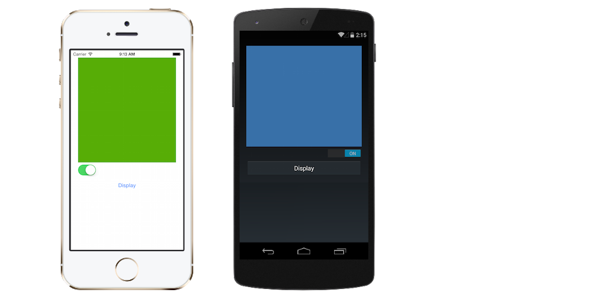
TBD

## `ProgressBar`


This is a control that needs to be handled differently for iOS and Android. We will also need to know how to invoke the native methods to set the date.

### Uniquely Identifying a `ProgressBar` on iOS

Native Control: [UIProgressView](https://github.com/xamarin/Xamarin.Forms/blob/master/Xamarin.Forms.Platform.iOS/Renderers/ProgressBarRenderer.cs)
Setting the `AutomationId` property on the `ProgressBar` will translate to the `Id` property to identify in `Xamarin.UITest`.

### Uniquely Identifying a `ProgressBar` on Android

Native Control: [Android.Widget.ProgressBar](https://github.com/xamarin/Xamarin.Forms/blob/master/Xamarin.Forms.Platform.Android/Renderers/ProgressBarRenderer.cs)
Setting the `AutomationId` property on the `ProgressBar` will translate to the `Label` property to identify the `Android.Widget.ProgressBar`.

### Setting `AutomationId` for a `ProgressBar` in Xamarin.Forms Project

```C#
ProgressBar progressBar = new ProgressBar { AutomationId = "LoadingProgress"};
```

### Interacting with a `ProgressBar` in Xamarin.UITest Project

#### Getting `ProgressBar` Current Level

```C#
if(OnAndroid)
    app.Query(x => x.Class("ProgressBar").Invoke("getProgress"))
else if(OniOS)
    app.Query(x => x.Class("UIProgressView").Invoke("progress"))
```

In the code above, we have to invoke native methods to check the progress level. On Android, we invoke the `Android.Widget.ProgressBar.getProgress()` method that returns a value between 0 and 10,000 (0 is 0% and 10,000 is 100%). On iOS, we invoke the `progress` property on the `UIProgressView` to return a value between 0 and 1.

#### Setting `ProgressBar` Current Level

```C#
if(OnAndroid)
    app.Query(x => x.Class("ProgressBar").Invoke("setProgress",5000)) //Sets ProgressBar to 50%, 100% = 10,000
else if(OniOS)
    app.Query(x => x.Class("UIProgressView").Invoke("setProgress:animated",0.5f)) //Sets ProgressBar to 50%, 100% = 1.0f
```

In the code above, we have to invoke native methods to set the progress level. On Android, we invoke the `Android.Widget.ProgressBar.setProgress()` method with value between 0 and 10,000 (0 is 0% and 10,000 is 100%). On iOS, we invoke the `setProgress(Float,animated: Bool)` method on the `UIProgressView` to return a value between 0 and 1.

## `SearchBar`

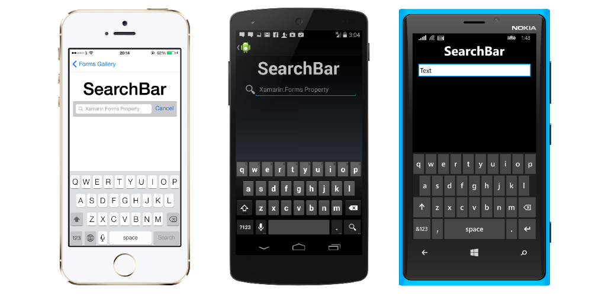

### Uniquely Identifying a `SearchBar` on iOS

Native Control: [UISearchBar](https://github.com/xamarin/Xamarin.Forms/blob/master/Xamarin.Forms.Platform.iOS/Renderers/SearchBarRenderer.cs) 
Setting the `AutomationId` property on the `SearchBar` will translate to the `Id` property to identify the `UISearchBar` in `Xamarin.UITest`. The "Cancel" button will have a `Label` property of "Cancel".

### Uniquely Identifying a `SearchBar` on Android

Native Control: [Android.Widget.SearchView](https://github.com/xamarin/Xamarin.Forms/blob/master/Xamarin.Forms.Platform.Android/Renderers/SearchBarRenderer.cs)
Setting the `AutomationId` property on the `SearchBar` will translate to the `Label` property to identify the `Android.Widget.SearchView`.

### Setting `AutomationId` for a `SearchBar` in Xamarin.Forms Project

```C#
SearchBar searchBar = new SearchBar { AutomationId = "UserSearchBar"};
```

### Interacting with a `SearchBar` in Xamarin.UITest Project

Since `Marked` looks at both the `Id` and `Label` properties, we can use `Marked` to uniquely identify the `SearchBar` on both iOS and Android.

```C#
//EnterText into SearchBar
app.EnterText(x => x.Marked("UserSearchBar"), "This is some text");
app.DismissKeyboard();

//ClearText from SearchBar
app.ClearText(x => x.Marked("UserSearchBar"));
app.DismissKeyboard();
```

The code above is an example of entering text into the Editor and clearing text from the Editor. Make sure you don't forget to dismiss the keyboard afterwards to ensure the keyboard isn't covering up any UI elements.

#### Cancelling The `SearchBar` Search in Xamarin.UITest Project

```C#
if(OnAndroid)
    app.Tap(x => x.Marked("Cancel"));
else if(OniOS)
    app.Tap(x => x.Id("search_close_btn")); 
```

In the code above, we can interact with the "Cancel" button found on the search controls. It is important to note that on Android, you might need to call `DismissKeyboard()` depending on how you are using the search and what version of Android you are on.

## `Stepper`

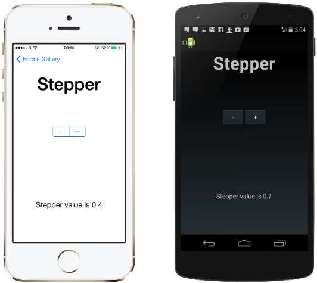

This is a control that needs to be handled differently for iOS and Android. We will also need to know how to invoke the native methods to set the date.

### Uniquely Identifying a `Stepper` on iOS

Native Control: [UIStepper](https://github.com/xamarin/Xamarin.Forms/blob/master/Xamarin.Forms.Platform.iOS/Renderers/StepperRenderer.cs)
Setting the `AutomationId` property on the `Stepper` will translate to the `Id` property to identify the `UIStepper` in `Xamarin.UITest`. The '+' and '-' buttons of the UIStepper will have `Label` properties of "Increment" and "Decrement".

### Uniquely Identifying a `Stepper` on Android

Native Control: [Android.Widget.LinearLayout](https://github.com/xamarin/Xamarin.Forms/blob/master/Xamarin.Forms.Platform.Android/Renderers/StepperRenderer.cs) with two internal `Android.Widget.Button`
Setting the `AutomationId` property on the `Stepper` will translate to the `Label` property to identify the `Android.Widget.SearchView`.

### Setting `AutomationId` for a `Stepper` in Xamarin.Forms Project

```C#
Stepper stepper = new Stepper { AutomationId = "MyStepper"};
```

### Interacting with a `Stepper` in Xamarin.UITest Project

#### Increasing the value of a `Stepper`

```C#
if(OnAndroid)
    app.Tap(x => x.Class("android.widget.Button").Text("+"))
else if(OniOS)
    app.Tap(x => x.Marked("Increment"));
```

#### Decreasing the value of a `Stepper`

```C#
if(OnAndroid)
    app.Tap(x => x.Class("android.widget.Button").Text("-"))
else if(OniOS)
    app.Tap(x => x.Marked("Decrement"));
```

#### Getting value of a `Stepper`

```C#
if(OnAndroid)
    //Would need to expose through Backdoor
    // TODO
else if(OniOS)
    app.Query(x => x.Id("MyStepper").Invoke("value")); 
```

## `Switch`

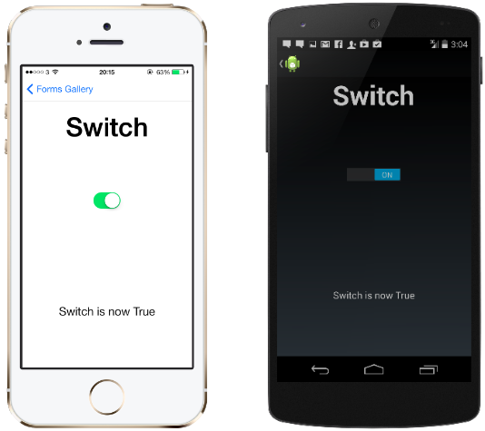

### Uniquely Identifying a `Switch` on iOS

Native Control: [UISwitch](https://github.com/xamarin/Xamarin.Forms/blob/master/Xamarin.Forms.Platform.iOS/Renderers/SwitchRenderer.cs)
Setting the `AutomationId` property on the `Switch` will translate to the `Id` property to identify the `UISwitch` in `Xamarin.UITest`. The '+' and '-' buttons of the UIStepper will have `Label` properties of "Increment" and "Decrement".

### Uniquely Identifying a `Switch` on Android

Native Control: [Android.Widget.Switch](https://github.com/xamarin/Xamarin.Forms/blob/master/Xamarin.Forms.Platform.Android/Renderers/SwitchRenderer.cs) with two internal `Android.Widget.Button`
Setting the `AutomationId` property on the `Switch` will translate to the `Label` property to identify the `Android.Widget.Switch`.

### Setting `AutomationId` for a `Switch` in Xamarin.Forms Project

```C#
Switch stepper = new Switch { AutomationId = "MySwitch"};
```

### Interacting with a `Switch` in Xamarin.UITest Project

Since `Marked` looks at both the `Id` and `Label` properties, we can use `Marked` to uniquely identify the `SearchBar` on both iOS and Android.

```C#
app.tap(x => x.Marked("MySwitch"));
```

## `TableView`

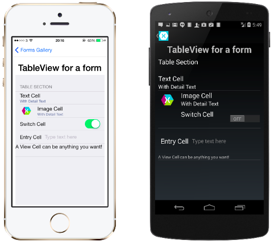

This is a control that needs to be handled differently for iOS and Android. We will also need to know how to invoke the native methods to set the date.

### Uniquely Identifying a `TableView` on iOS

Native Control: [UITableView](https://github.com/xamarin/Xamarin.Forms/blob/master/Xamarin.Forms.Platform.iOS/Renderers/TableViewRenderer.cs) 
Setting the `AutomationId` property on the `TableView` will translate to the `Id` property to identify the `UITableView` in `Xamarin.UITest`.

### Uniquely Identifying a `TableView` on Android

Native Control: [Android.Widget.LinearLayout](https://github.com/xamarin/Xamarin.Forms/blob/master/Xamarin.Forms.Platform.Android/Renderers/TableViewRenderer.cs) with two internal `Android.Widget.Button`
Setting the `AutomationId` property on the `TableView` will translate to the `Label` property to identify the `Android.Widget.SearchView`.

```C#
TableView tableView = new TableView { AutomationId = "MyTableView"};
```

### Interacting with a `TableView` in Xamarin.UITest Project

Since `Marked` looks at both the `Id` and `Label` properties, we can use `Marked` to uniquely identify the `Xamarin.Forms.ListView` on both iOS and Android. 

```C#
app.Query(x => x.Marked("MyTableView");
```

### Interacting with Built-in Xamarin.Forms.Cells in Xamarin.UITest Project

These cells are typically constructed together with a combination of other elements. Due to this, we typically have to identify the cell in some way and access the objects through the `Child()` method in `Xamarin.UITest`.

#### Interacting with an `TextCell` in Xamarin.UITest Project

```C#
app.Query(x => x.Marked("TextCell Text"));
```

#### Interacting with an `EntryCell` in Xamarin.UITest Project

```C#
//Enter some text
if(OniOS)
{
    app.EnterText(x => x.Class("Xamarin_Forms_Platform_iOS_EntryCellRenderer_EntryCellTableViewCell").Child(0).Child(0), "Text to enter"); 
    app.DismissKeyboard();
} else if (OnAndroid)
{
    app.EnterText(x => x.Class("EntryCellView").Child(1), "Text to enter"); 
    app.DismissKeyboard();
}

//Clear text
if(OniOS)
    app.ClearText(x => x.Class("Xamarin_Forms_Platform_iOS_EntryCellRenderer_EntryCellTableViewCell").Child(0).Child(0));
else if (OnAndroid)
    app.ClearText(x => x.Class("EntryCellView").Child(1)); 
```

In the code above on iOS, we have to interact with the cell children to enter text or clear text. Each `EntryCell` will have three children on iOS, the first index (0) is the physical view of the cell while the next two indexes (1 and 2) are the `UITableViewCellSeparatorView`. After we access the Cell view, there are two more children of this view: the `UILabel` and `UITextField` of the `EntryCell`. We will want to access the first child which is the `UITextField`.

In the code above on Android, we have to interact with the cell children to enter text or clear text. Each `EntryCell` will have two children on Android, the first index (0) is the `TextView` containing the text displayed in the cell. The second index (1) is the physical `Entry` for the user to input.

#### Interacting with an `SwitchCell` in Xamarin.UITest Project

```C#
if(OnAndroid)
     app.Query(x => x.Class("SwitchCellView").Class("Switch").Invoke("setChecked", {true or false});
else if(OniOS)
    app.Query(x => x.Class("Xamarin_Forms_Platform_iOS_CellTableViewCell").Class("UISwitch").Invoke("setOn:animated", {true or false}));   
```

In the code above, we have to interact with the cell children to toggle the `Switch`. We can directly invoke the native class of the `Switch` element to toggle it.

## `TimePicker`

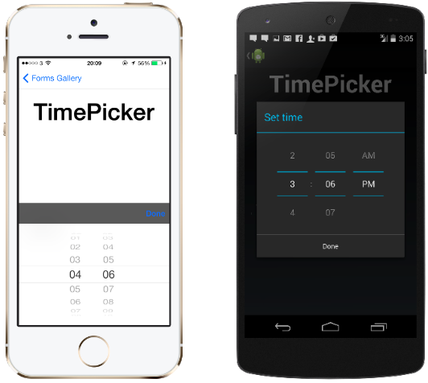
This is a control that needs to be handled differently for iOS and Android. We will also need to know how to invoke the native methods to set the time.

### Uniquely Identifying a `TimePicker` on iOS

Native Control: [UITextField](https://github.com/xamarin/Xamarin.Forms/blob/74cb5c4a97dcb123eb471f6b1dffa1267d0305aa/Xamarin.Forms.Platform.iOS/Renderers/DatePickerRenderer.cs) with internal `UIDatePicker`
Setting the `AutomationId` property on the `TimePicker` will translate to the `Id` property to identify in `Xamarin.UITest`.

We will need to first tap on the `UITextField` to engage the `UIDatePicker`. From there we will need to invoke the native method `selectRow()` on the `UIDatePicker` and press the "ok" button.

### Interacting with an iOS `TimePicker` in Xamarin.UITest Project

```C#
//Activate the DatePicker
app.Tap(x => x.Id("{AutomationId of Xamarin.Forms.DatePicker}"));

//Wait for DatePicker animation to completed
app.WaitForElement(x => x.Class("UIPickerView"));

//Invoke the native method selectRow() 
app.Query (x => x.Class ("UIPickerView").Invoke ("selectRow", time.Hour , "inComponent", 0, "animated", true)); //if time.Hour == 0, than hour is '1'. if time.Hour == 11, than hour is '12'
app.Query (x => x.Class ("UIPickerView").Invoke ("selectRow", time.Minutes, "inComponent", 1, "animated", true)); //if time.Minute == 0, than minutes is '1'. if time.Minute == 59, than minutes is '59'
app.Query (x => x.Class ("UIPickerView").Invoke ("selectRow", 0, "inComponent", 2, "animated", true)); //0 == AM and 1 == PM
```

The code above shows how we can invoke the `selectRow()` method on the DatePicker. The "Done" button will always have an `Class` property of "UIToolbarTextButton".

### Uniquely Identifying a `TimePicker` on Android

Native Control: [Android.Widget.TimePicker](https://github.com/xamarin/Xamarin.Forms/blob/master/Xamarin.Forms.Platform.Android/Renderers/TimePickerRenderer.cs) with `Android.Widget.EditText`  
Setting the `AutomationId` property on the `TimePicker` will translate to the `Label` property to identify the `Android.Widget.EditText`.

We will need to first tap on the `Android.Widget.EditText` to engage the `Android.Widget.TimePicker`. From there we will need to invoke the native method `updateDate()` on the `Android.Widget.TimePicker` and press the "ok" button.

### Setting `AutomationId` for a `TimePicker` in Xamarin.Forms Project

```C#
TimePicker myTime = new TimePicker { AutomationId = "MyTimePicker"};
```

### Interacting with an Android `TimePicker` in Xamarin.UITest Project

```C#
//Activate the TimePicker
app.Tap(x => x.Id("MyTimePicker"));

//Wait for TimePicker animation to completed
app.WaitForElement(x => x.Id("timePicker"));

//Invoke methods to select time
app.Query(x => x.Id("timePicker").Invoke("setHour",3));
app.Query(x => x.Id("timePicker").Invoke("setMinute",30));

//Tap the ok button to close the TimePicker dialogue
app.Tap(x => x.Id("button1"));//Ok Button in TimePicker Dialogue
```

The code above shows how we can invoke the `Android.Widget.TimePicker` methods to set the time. The "ok" button will always have an `Id` property of "button1". The "cancel" button will always have an `Id` property of "button2".


## `WebView`

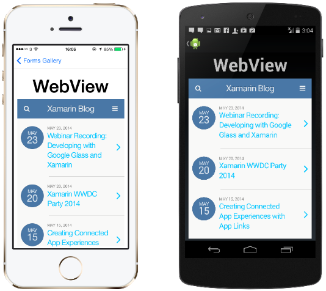

This is a control that needs to be handled differently for iOS and Android. We will also need to know how to invoke the native methods to set the time.

### Uniquely Identifying a `WebView` on iOS

Native Control: [UIWebView](https://github.com/xamarin/Xamarin.Forms/blob/74cb5c4a97dcb123eb471f6b1dffa1267d0305aa/Xamarin.Forms.Platform.iOS/Renderers/WebViewRenderer.cs)  
Setting the `AutomationId` property does not work for the `WebView` control and we must identify the `WebView` through its class: `Xamarin_Forms_Platform_iOS_WebViewRenderer`.

### Uniquely Identifying a `WebView` on Android

Native Control: [Android.Widget.WebView](https://github.com/xamarin/Xamarin.Forms/blob/master/Xamarin.Forms.Platform.Android/Renderers/WebViewRenderer.cs).
Setting the `AutomationId` property on the `TimePicker` will translate to the `Label` property to identify the `Android.Widget.WebView`.

### Interacting with a `WebView` in Xamarin.UITest Project

#### Verify `WebView` Is Loading in Xamarin.UITest Project

```C#
if(OnAndroid)
    int loadingProgress = app.Query(x => x.Marked("{WebView AutomationId}").Invoke("getProgress")); //Returns a value between 0-100
else if(OniOS)
    int isLoading = app.Query(x => x.Class("Xamarin_Forms_Platform_iOS_WebViewRenderer").Invoke("isLoading")); //0 = false, 1 = true
```

#### Get Current Request URL in Xamarin.UITest Project

```C#
if(OnAndroid)
    string url = app.Query(x => x.Marked("{WebView AutomationId}").Invoke("getUrl");
else if(OniOS)
    string url = app.Query(x => x.Class("Xamarin_Forms_Platform_iOS_WebViewRenderer").Invoke("request"));
```

#### Reload Current `WebView` in Xamarin.UITest Project

```C#
if(OnAndroid)
    app.Query(x => x.Marked("{WebView AutomationId}").Invoke("reload"));
else if(OniOS)
    app.Query(x => x.Class("Xamarin_Forms_Platform_iOS_WebViewRenderer").Invoke("reload"));
```

#### Navigate Back in Current `WebView` in Xamarin.UITest Project

```C#
if(OnAndroid)
    app.Query(x => x.Marked("{WebView AutomationId}").Invoke("goBack"));
else if(OniOS)
    app.Query(x => x.Class("Xamarin_Forms_Platform_iOS_WebViewRenderer").Invoke("goBack"));
```

#### Navigate Forward in Current `WebView` in Xamarin.UITest Project

```C#
if(OnAndroid)
    app.Query(x => x.Marked("{WebView AutomationId}").Invoke("goForward"));
else if(OniOS)
    app.Query(x => x.Class("Xamarin_Forms_Platform_iOS_WebViewRenderer").Invoke("goForward"));
```

#### Evaluate Javascript in Current `WebView` in Xamarin.UITest Project

```C#
string javascript = "document.getElementById(\"lst-ib\").value=\"Hello\"; //Javascript to change google.com search bar text to "Hello"

if(OnAndroid)
     app.Query(x => x.Marked("{WebView AutomationId}").InvokeJS(javascript)); 
else if(OniOS)
    app.Query(x => x.Class("Xamarin_Forms_Platform_iOS_WebViewRenderer").InvokeJS(javascript));
```

## `ToolbarItems`

### Uniquely Identifying a `ToolbarItem` on iOS

Native Control: [UIBarButtonItem](https://github.com/xamarin/Xamarin.Forms/blob/74cb5c4a97dcb123eb471f6b1dffa1267d0305aa/Xamarin.Forms.Platform.iOS/Extensions/ToolbarItemExtensions.cs)
Setting the `AutomationId` property on the `ToolbarItem` will translate to the `Id` property to identify the `UINavigationBarButton` in `Xamarin.UITest`.

### Setting `AutomationId` for a `ToolbarItem` in Xamarin.Forms Project

```C#
//Setting the AutomationId property of ToolBarItem
ToolbarItem firstButton = new ToolbarItem { AutomationId = "ToolbarButtonOne"};

### Interacting with an iOS `ToolbarItem` in Xamarin.UITest Project

//Tapping the NavBar button
app.Tap(x => x.Id("ToolbarButtonOne"));
```

### Uniquely Identifying a `ToolbarItem` on Android

Native Control: [Android.Widget.Button](https://github.com/xamarin/Xamarin.Forms/blob/master/Xamarin.Forms.Platform.Android/Renderers/ToolbarButton.cs) with two internal `Android.Widget.Button`
Setting the `AutomationId` property on the `ToolbarItem` does not work. Whatever the `ToolbarItem.Text` property is set to will be translated to the `Label` property in `Xamarin.UITest`.

### Setting `ToolbarItem.Text` property in Xamarin.Forms Project

```C#
//Setting the AutomationId property of ToolBarItem
ToolbarItem firstButton = new ToolbarItem { AutomationId = "ToolbarButtonOne", Text = "ToolBarButtonText" };

//Tapping the NavBar button
app.Tap(x => x.Marked("ToolBarButtonText"));
```